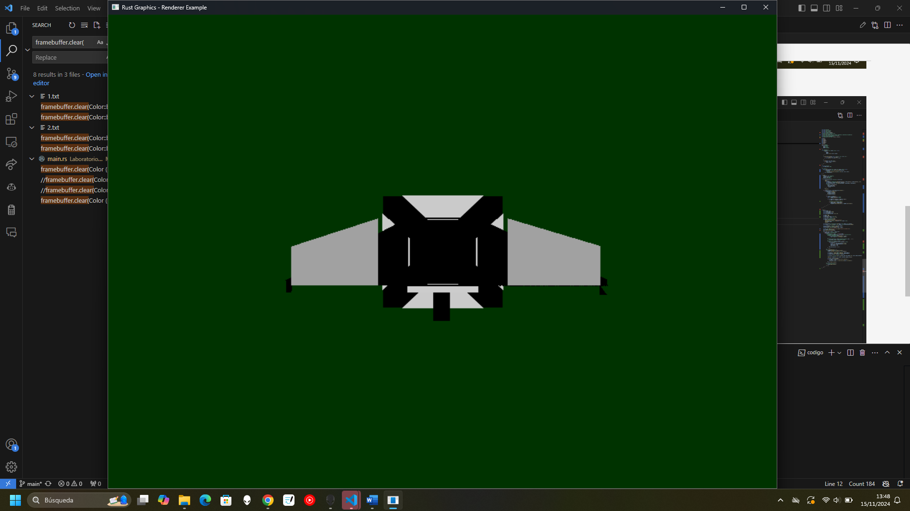
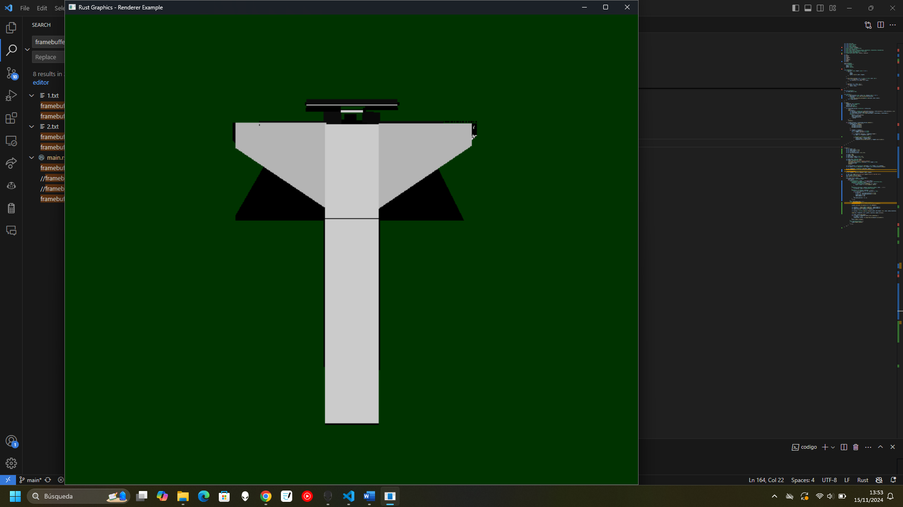

# Laboratorio3-GraficasXComputadoras

Lab 3: Modelo 3D

para ejecutar el programa

uso del Render del modelo (usar Mouse obligatorio)

1. giro scroll hacia delante: acercar zoom
2. giro scroll hacia delante: alejar zoom
3. precionar scroll y girar derecha-izquierda: gira horizontal el objeto
4. precionar scroll y girar adelante-atras: gira vertical el objeto

## Códigos importantes

Ejecutarlo forma #1

    ``cargo run``

Ejecutarlo forma #2

    ``cargo build --release``

    ``./target/release/codigo``
